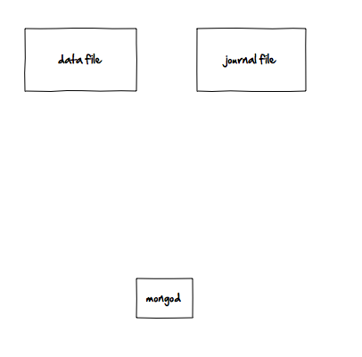
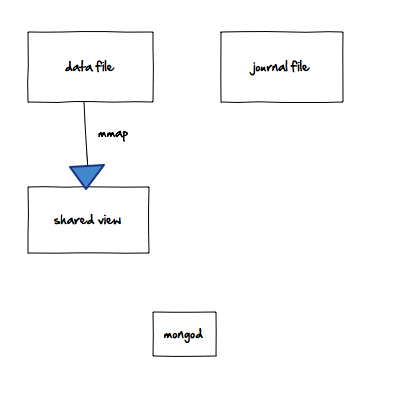
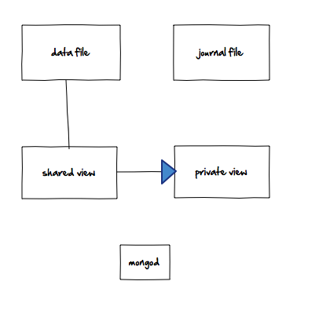
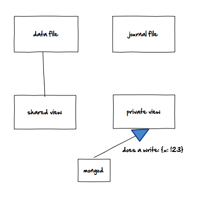
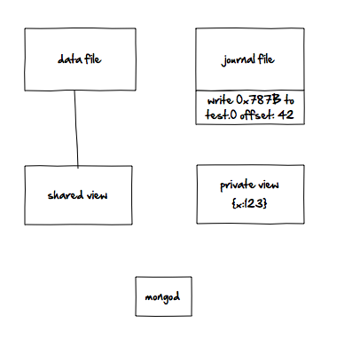
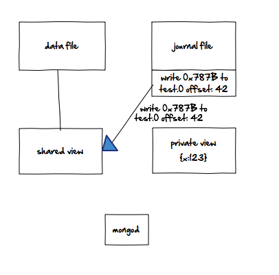
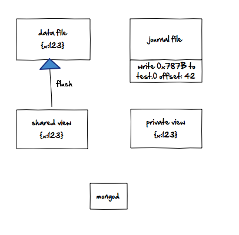
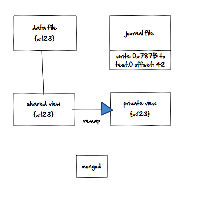

# How MongoDB's Journaling Works

>警告：本文提到的日志是MonogDB的预写日志（即journaling）不是MongoDB日志文件。

Journaling是如何工作的？

#### 没有日志记录的mongod工作方式：
你的磁盘包括数据文件和日志文件，我们将这样表示：

当你启动 MongoDB 时，他会将你的数据文件映射到共享视图。基本上就是，操作系统说：“好的，你的数据文件在磁盘上是2,000字节。我将它映射到内存地址1,000,000-1,002,000。因此，如果您在内存地址1,000,042读取内存，您将获得文件的第42个字节。“（此外，在您实际访问该内存之前，不需要加载数据。）

此内存仍然由文件支持，如果在内存中进行更改，操作系统会将这些更改刷新到基础文件，它要求操作系统每60秒刷新一次内存中的更改。这基本上是没有日志记录的mongod工作方式。

#### 使用日志记录的Mongodb工作方式：
使用日记功能，mongod会进行第二次映射，这个映射到私有视图。顺便提一下，这就是为什么启用日志功能会使mongod使用的虚拟内存量增加一倍。

请注意，私有视图未连接到数据文件，因此操作系统无法刷新从专用视图到磁盘的任何更改。现在，当你进行写操作时，mongod会将其写入私有视图。

然后，mongod会将此更改写入日志文件，创建一个关于哪个文件更改的字节的描述。

该日志文件附加了它获得的每个变更描述。

此时，写入是安全的。如果mongod崩溃，日志可以重播更改,即使它尚未进入数据文件.

然后，日志将在共享视图上重播此更改。

最后，与其他所有内容一样，以相同的速度将共享视图刷新到磁盘。默认情况下，mongod请求操作系统每60秒执行一次此操作。

最后一步是mongod将共享视图重新映射到私有视图。这可以防止私有视图变得太“脏”（从映射的共享视图中进行了太多更改，私有视图得不到及时的更新没有实时实际数据）。

